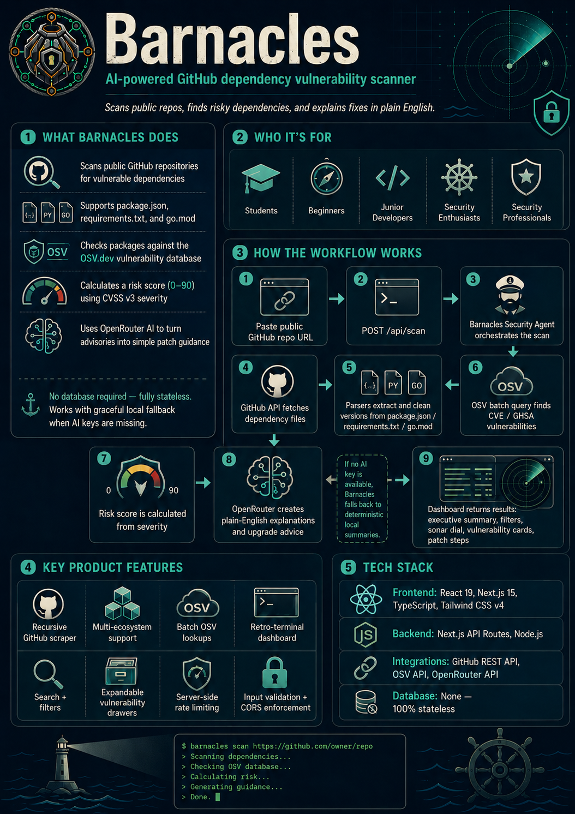
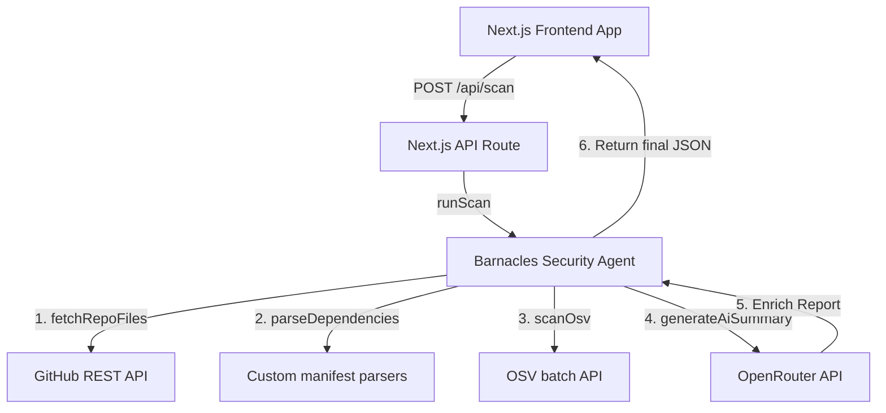

# ⚓ Barnacles

Barnacles is a clean, beginner-friendly, and AI-powered **GitHub dependency vulnerability scanner**. It helps developers, students, and security enthusiasts easily check the health of repository dependency files and understand how to patch security flaws using simple English.

By combining fast, deterministic database lookups from the **Open Source Vulnerabilities (OSV) API** with strategic AI guidance via **OpenRouter**, Barnacles bridges the gap between raw security data and actionable human-friendly solutions.

---

---

## 🚀 Project Overview

* **Purpose**: Easily scan public GitHub repositories for insecure dependencies, calculate risk scores, and translate complex security advisories into clear, non-jargon explanations and step-by-step remediation advice.
* **Target Users**: Students, beginners, junior developers, and security professionals looking for a simple, visual, and highly descriptive way to audit package health.
* **Current Status**: **MVP / Stable Prototype** — Fully functional scanning, deterministic threat calculation, AI enrichment, and a responsive dashboard.

---

## ⚡ Current Features

### What Works Now (Current Features)
* **GitHub Repository Scraper**: Paste any public repository URL (including monorepos or subfolders) to recursively traverse files up to a depth of 2.
* **Multi-Ecosystem Support**: Out-of-the-box support for JavaScript/TypeScript (`package.json`), Python (`requirements.txt`), and Go (`go.mod`).
* **Fast Deterministic OSV batch queries**: Scans packages against the public `OSV.dev` database in a single batch query for maximum performance.
* **Security-First Hazard Matrix**: Automatically computes risk scores (0 to 90) based on the highest vulnerability severity using CVSS v3 metrics.
* **AI-Powered Explanations**: Converts complex CVE and GHSA descriptions into plain-English summaries and clear upgrade steps (utilizing OpenRouter's free model integration).
* **Graceful Sandboxing**: Operates beautifully even without API keys by falling back to robust, local deterministic summaries and patching recommendations.
* **Sleek Retro-Terminal Dashboard**: A premium, responsive UI featuring real-time filters (by ecosystem or threat level), text-based package search, and expandable vulnerability card drawers. Includes a live sonar dial for risk visualization and a simulated terminal console during scanning.
* **Built-in Rate Limiting**: Server-side rate limiting (10 scans/minute per IP) with CORS origin enforcement and strict input validation.

---

## 🛠️ Tech Stack

* **Frontend**: React (v19), Next.js (v15, App Router), TypeScript, Tailwind CSS v4, Lucide React (Icons), and Framer Motion (Animations).
* **Backend**: Next.js API Routes, TypeScript, Node.js.
* **AI Engine**: Free open-source models via the **OpenRouter API** (with local fallback logic).
* **Database**: None (100% stateless! Real-time telemetry is fetched live from the public `OSV.dev` API).
* **Build System**: Next.js (client + server bundling).

---

## 📁 Project Structure

Below is an overview of the key folders in this project to help both human developers and AI assistants navigate the codebase efficiently:

```bash
Barnacles/
├── app/                    # Next.js App Router — pages and API routes
│   ├── api/                # Next.js Route Handlers
│   │   ├── scan/route.ts   # POST /api/scan — orchestrates the full vulnerability sweep
│   │   └── health/route.ts # GET /api/health — liveness check
│   ├── components/         # Modular retro-terminal UI components
│   │   ├── sonar-dial.tsx        # Animated risk-score dial displaying the overall hazard rating
│   │   └── vulnerability-card.tsx # Drawer container displaying CVE/GHSA alerts, CVSS, and AI advice
│   ├── globals.css         # Global styles (Tailwind v4 integration, keyframes, animation vocabulary)
│   ├── layout.tsx          # Root HTML layout with metadata and security headers
│   └── page.tsx            # Primary dashboard interface and state coordinator
├── server/                 # Scanner service modules (shared by API routes)
│   ├── agent.ts            # Security Agent Orchestrator combining scanning, OSV database, and AI Summaries
│   ├── openrouter.ts       # OpenRouter API client (queries free model with neutral prompts)
│   ├── osv.ts              # Batch client querying OSV API, parsing CVSS v3, and computing risk index
│   ├── parsers.ts          # Custom AST/Regex matchers parsing package.json, requirements.txt, and go.mod
│   └── scanner.ts          # Git scraper pulling public dependency manifests via GitHub's API
├── src/
│   └── types.ts            # TypeScript definitions for request/response payloads
├── public/                 # Static assets (logo, favicon)
├── next.config.js          # Next.js config — security headers (CSP, X-Frame-Options, etc.)
├── postcss.config.js       # PostCSS config for Tailwind v4
├── package.json            # Build scripts and dependency configurations
└── tsconfig.json           # Global TypeScript configuration
```

---

## 🏛️ Quick Architecture Overview



### High-Level Components
* **Frontend**: A Next.js App Router application styled with Tailwind CSS v4. It triggers repository audits, provides a live terminal console and sonar dial during scanning, and lets users search, filter, and drill into vulnerabilities.
* **Backend**: Next.js API Routes that act as a proxy for remote API requests. Rate limiting, CORS origin checks, and input sanitization are applied at the route layer before handing off to the scanner agent.
* **Database**: Barnacles does not require a local database. It is entirely stateless, querying live public sources.
* **External Integrations**:
  * **GitHub REST API**: Downloads raw dependency files from public repositories without needing account access.
  * **OSV API**: Batches query lookups to find active CVE/GHSA disclosures based on packages and versions.
  * **OpenRouter API**: Communicates with a free model to generate structured, user-neutral advisories and plain-English translations of security bulletins.

---

## 🔄 Workflow Overview

### 1. User Workflow
1. The user copies a public GitHub repository link (e.g., `https://github.com/expressjs/express`).
2. They paste the link into the URL input and click **Scan Repository**.
3. While the scan runs, they see a simulated terminal console and an animated sonar dial showing progress.
4. Once loaded, they receive a comprehensive executive summary from the AI and can expand individual package drawers to read CVE details and exact patch guidelines.

### 2. AI & Data Workflow
1. The Next.js API route passes the URL to the **Barnacles Security Agent**.
2. The agent fetches and identifies dependency files (`package.json`, `requirements.txt`, `go.mod`) via the GitHub API.
3. Custom regex/parsers clean CARETS (`^`), tildes (`~`), and wildcards to isolate clean semantic versions.
4. Clean version strings are batched and checked against the **OSV API**.
5. Discovered vulnerabilities are calculated deterministically to assign a severity risk level.
6. The agent sends the raw vulnerabilities to **OpenRouter**, instructing the AI to create a human-friendly assessment using neutral, objective language.
7. The enriched JSON payload is returned to the user's dashboard.

### 3. Development Workflow
* **Local Iterations**: Running `npm run dev` boots the Next.js dev server with hot-reloading for both frontend and backend route changes.
* **Persisting Scans**: Set `SAVE_TEST_RESULTS=true` in `.env` to automatically output raw scan results into `test-results/` for offline inspection and quality tuning (capped at 25 files).

---

## ⚡ Setup & Installation

### Prerequisites
* **Node.js**: Version 18.x or higher installed on your computer.

### 1. Install Dependencies
Clone the repository and install the standard node packages:
```bash
npm install
```

### 2. Set Up Environment Variables
Create a `.env` file in the root directory (or copy from `.env.example`):
```bash
cp .env.example .env
```

Fill in the following variables:
```ini
# Required for AI summaries. If omitted, Barnacles runs on offline fallback mode!
OPENROUTER_API_KEY="your_openrouter_api_key_here"

# Optional: Add a GitHub Token to raise public API rate limits from 60 to 5000 requests/hr
GITHUB_TOKEN="your_personal_access_token_here"

# Required for hosting links and CORS origin enforcement
APP_URL="http://localhost:3000"

# Optional: Set to "true" to save scan results to test-results/ (development only)
SAVE_TEST_RESULTS="true"
```

### 3. Run Development Server
Start the Next.js dev server with live-reloading:
```bash
npm run dev
```
Open your browser and visit: **`http://localhost:3000`**

### 4. Build for Production
To build the optimized Next.js application:
```bash
npm run build
```
To run the built production server:
```bash
npm start
```

---

> [!WARNING]
> **Disclaimer: Educational and Testing Use Only**
> 
> Barnacles is a portfolio project and an MVP prototype developed strictly for educational purposes, security demonstrations, and testing. It is **not** designed or intended to be integrated into production environments, CI/CD pipelines, or active enterprise workflows. 
> 
> This software is provided "as is" without warranty of any kind, express or implied, including but not limited to the warranties of merchantability, fitness for a particular purpose, or non-infringement. While Barnacles utilizes public vulnerability data from OSV.dev, it should not be relied upon as a primary or comprehensive security auditing tool. Always use industry-standard, officially supported tooling (like `npm audit`, `pip-audit`, or commercial security suites) for production codebase compliance and vulnerability management.
